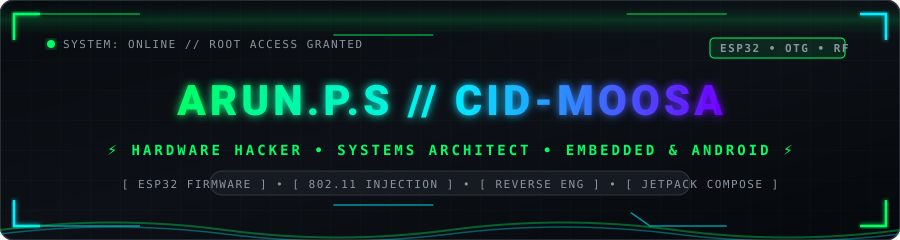
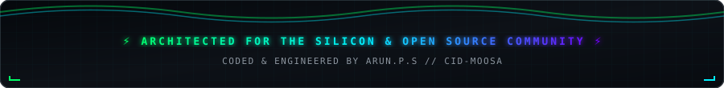

<div align="center">

<!-- High-Tech Cyber Forensics Animated Header Banner -->


<!-- Dynamic Animated Cyber Forensics Terminal Typing SVG -->
<a href="https://git.io/typing-svg">
  
</a>

<br/>

<!-- Connect & Status Badges -->
<p align="center">
  <a href="https://discord.gg/cidm00sa"></a>
  <a href="https://instagram.com/cidmoosa.onion"></a>
  <a href="mailto:arun.p.s2022@protonmail.com"></a>
  
</p>

</div>



### 🛰️ Forensics Dossier & Investigator Profile
```ini
[INVESTIGATOR]: ARUN.P.S (alias: cid-moosa)
[STATUS / LEVEL]: 17-Year-Old Cyber Forensics College Student & Digital Investigator
[SPECIALIZATION]: Hardware Forensics, 802.11 RF Auditing, USB OTG Protocol Analysis, ROM Extraction
[CORE_TENET]: "Every contact leaves a trace — from volatile memory registers to RF airwaves."
```
> **I dissect technology at the silicon, signal, and packet levels.** As a 17-year-old cyber forensics college student, my mission centers on breaking down how data travels, how hardware executes low-level instructions, and how digital artifacts can be intercepted, preserved, and decoded. Whether it's dumping SPI flash from embedded chips, building custom packet injection drivers, or reverse engineering USB OTG dongles, I investigate the boundary where hardware meets cybersecurity.

---

### ⚡ Live Investigation Telemetry (Contribution Snake)

<div align="center">
  
</div>


### 🔬 Forensics & Hardware Research Operations

<table>
  <tr>
    <td width="50%" valign="top">
      <h3 align="center">📡 <a href="https://github.com/cid-moosa/snorty-android">Snorty Android</a> & <a href="https://github.com/cid-moosa/snorty-esp32">ESP32 Agent</a></h3>
      <p><b>Wireless Recon &amp; 802.11 Auditing:</b> Real-time native Android Wardrive companion paired with an ESP32 C++ promiscuous mode probe sniffer &amp; beacon telemetry agent.</p>
      <p align="center">
        
        
        
      </p>
    </td>
    <td width="50%" valign="top">
      <h3 align="center">⚡ <a href="https://github.com/cid-moosa/ir-blaster">USB IR Blaster & Learner</a></h3>
      <p><b>Hardware Forensics &amp; Protocol Reversal:</b> USB Type-C OTG signal decoder for consumer IR dongles (Getzget, Ocrustar, ZaZa, Tiqiaa) with raw hex pulse extraction.</p>
      <p align="center">
        
        
        
      </p>
    </td>
  </tr>
  <tr>
    <td width="50%" valign="top">
      <h3 align="center">🦊 <a href="https://github.com/cid-moosa/KALI-FOX">KALI-FOX</a> & <a href="https://github.com/cid-moosa/PIPY-FOX">PIPY-FOX</a></h3>
      <p><b>Driver Architecture &amp; Packet Injection:</b> Automated Linux kernel compilation suite for RTL8188EUS wireless chips, enabling monitor mode and 802.11 frame injection.</p>
      <p align="center">
        
        
        
      </p>
    </td>
    <td width="50%" valign="top">
      <h3 align="center">📟 <a href="https://github.com/cid-moosa/esp32-flasher">ESP32 Flasher & Monitor</a></h3>
      <p><b>Firmware Analysis &amp; Flash Utilities:</b> GUI utility and real-time Serial Monitor for writing, dumping, and analyzing firmware on ESP32 microcontrollers.</p>
      <p align="center">
        
        
        
      </p>
    </td>
  </tr>
  <tr>
    <td width="50%" valign="top">
      <h3 align="center">🤖 <a href="https://github.com/cid-moosa/jarvis-ai-assistant">Jarvis v2.0 Forensic Assistant</a></h3>
      <p><b>Automated Perception &amp; Voice Operations:</b> Hybrid AI voice assistant with animated WebUI, dual voice/text pipeline, Gemini LLM fallback, and OpenCV optical perception.</p>
      <p align="center">
        
        
        
      </p>
    </td>
    <td width="50%" valign="top">
      <h3 align="center">📻 <a href="https://github.com/cid-moosa/wakitaki">Wakitaki</a> & <a href="https://github.com/cid-moosa/stealth-dl">Stealth-DL</a></h3>
      <p><b>Encrypted Streams &amp; Resilient Daemons:</b> Serverless, offline-first P2P audio walkie-talkie Android app alongside a resilient multi-threaded Telegram media pipeline.</p>
      <p align="center">
        
        
        
      </p>
    </td>
  </tr>
</table>


### 🛠️ Cyber Forensics & Investigation Arsenal

<div align="center">
  
</div>

<br/>

<details open>
<summary><b>🔍 Cyber Forensics, Network Security & Auditing</b></summary>
<br/>


</details>

<details open>
<summary><b>⚡ Hardware Lab, Silicon & Embedded Systems</b></summary>
<br/>


</details>

<details open>
<summary><b>💻 Languages & Core Runtime</b></summary>
<br/>


</details>


### 📈 Forensics Activity Radar & Metrics

<div align="center">
  
</div>

<br/>

<div align="center">
  
  
</div>

<br/>

<div align="center">
  
</div>

<br/>

<div align="center">
  <h3>🏆 Security &amp; Developer Trophies</h3>
  
</div>

<br/>

<!-- Native Animated Cyber Forensics Footer -->
<div align="center">
  
</div>
